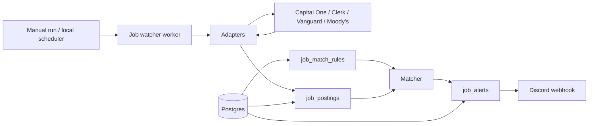
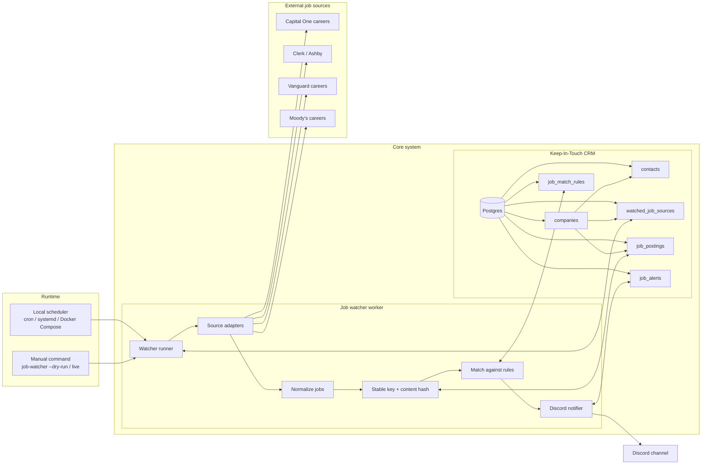

# Job Watcher Adapter Design

This document captures the Phase 3 adapter-based ingestion design for the
company job watcher.

## Status

Complete

## Design Goals

- Keep source-specific scraping/parsing isolated behind adapters.
- Keep matching, persistence, and notification decisions out of adapters.
- Prefer direct HTTP fetch and deterministic parsing.
- Let one broken source fail without breaking the whole watcher run.
- Make dry-run output use the same adapter and normalization path as live runs.

## Architecture Overview

### High-Level Flow



### Detailed Flow



## Core Types

### Watched Source Config

The adapter runner should load enabled watched sources from Postgres using the
schema documented in `docs/schema.md`.

Runtime shape:

```java
record WatchedJobSourceConfig(
    UUID id,
    UUID companyId,
    String companyName,
    JobSourceType sourceType,
    String originalSourceUrl,
    String canonicalSourceUrl,
    boolean enabled
) {}
```

`originalSourceUrl` is always preserved. `canonicalSourceUrl` can be null until
source discovery has confirmed a more stable implementation URL.

### Normalized Job

Adapters should normalize source-specific data into one shared shape before the
runner performs fingerprinting, matching, or persistence.

```java
record NormalizedJob(
    String externalId,
    String stableKey,
    String title,
    String companyName,
    String location,
    String country,
    String url,
    String canonicalUrl,
    String applyUrl,
    String department,
    String jobCategory,
    String experienceLevel,
    OffsetDateTime postedAt,
    String descriptionSnippet,
    String rawSource
) {}
```

Notes:

- `externalId` is nullable because some boards may not expose a durable ID.
- `stableKey` is nullable at adapter output time; the runner can generate it if
  the adapter leaves it empty.
- `rawSource` should be optional and should not store huge HTML pages in the
  database. It is mainly useful for fixture tests or compact debugging context.

### Adapter Result

Adapters should return structured success/failure data instead of throwing for
ordinary parse failures.

```java
sealed interface JobSourceResult permits JobSourceSuccess, JobSourceFailure {}

record JobSourceSuccess(
    WatchedJobSourceConfig source,
    List<NormalizedJob> jobs,
    String canonicalSourceUrl
) implements JobSourceResult {}

record JobSourceFailure(
    WatchedJobSourceConfig source,
    String message,
    String failingUrl,
    Throwable cause
) implements JobSourceResult {}
```

Zero jobs is a successful result with an empty `jobs` list.

## Adapter Contract

The practical Java interface should keep one public entry point and allow source
implementations to split fetch/parse helpers internally.

```java
interface JobSourceAdapter {
  JobSourceType sourceType();

  JobSourceResult fetchAndParse(WatchedJobSourceConfig source);
}
```

Internal helper methods can follow the conceptual plan:

```java
RawJobSource fetchRaw(WatchedJobSourceConfig source);

List<RawJob> parseJobs(RawJobSource raw, WatchedJobSourceConfig source);

NormalizedJob normalizeJob(RawJob rawJob, WatchedJobSourceConfig source);

String getExternalId(NormalizedJob job);

String getContentHash(NormalizedJob job);
```

The public interface should not require every adapter to expose these helpers.
Some sources, such as Ashby, may fetch already-structured JSON and do less HTML
parsing.

## Adapter Responsibilities

Adapters should:

- Fetch only from configured source URLs or discovered canonical URLs.
- Parse raw source data into normalized jobs.
- Preserve source-provided IDs, URLs, titles, locations, dates, and metadata.
- Handle empty job lists as success.
- Return source-specific failures with enough context to debug.
- Avoid writing to the database directly.
- Avoid sending notifications.
- Avoid applying user-specific matching logic.

Adapters should not:

- Decide whether a job is relevant to the user.
- Create or update `job_postings`.
- Create `job_alerts`.
- Send Discord webhook messages.
- Read Discord secrets.
- Start browser automation in MVP.

## Runner Responsibilities

The watcher runner/service coordinates adapters and persistence.

Runner flow:

1. Load enabled `watched_job_sources` from Postgres.
2. Select an adapter based on `source_type`.
3. Run each adapter independently.
4. Record `last_checked_at` for every attempted source.
5. For successful sources, clear `last_error` and update
   `last_successful_check_at`.
6. Generate `stableKey` for each normalized job if the adapter did not provide
   one.
7. Generate `contentHash` from normalized job content.
8. Upsert `job_postings` by `(source_id, stable_key)`.
9. Update `last_seen_at` and changed metadata for existing jobs.
10. Mark missing jobs as `REMOVED` only after the configured safe threshold.
11. Run deterministic matching against new or active postings.
12. Create/send alerts only after checking existing `SENT` alerts.
13. Log a summary of sources checked, jobs found, new jobs, matches, alerts,
   and failures.

## Stable Key Rules

Preferred stable key:

```text
sourceType + externalId
```

Fallback stable key:

```text
sourceType + normalized title + normalized location + canonical URL
```

Normalization for fallback keys:

- Trim leading/trailing whitespace.
- Collapse repeated whitespace.
- Lowercase text.
- Strip URL tracking parameters where practical.
- Prefer canonical URL over raw URL when available.

## Content Hash Rules

The content hash should be generated from fields that represent meaningful job
content:

- title
- location
- country
- canonical URL or URL
- apply URL
- department
- job category
- experience level
- posted date
- description snippet

Do not include volatile fields such as `firstSeenAt`, `lastSeenAt`, or current
run timestamps.

## Source-Specific Adapter Choices

### CapitalOneCareersAdapter

Use server-rendered Radancy/TalentBrew search result pages.

Initial source:

```text
https://www.capitalonecareers.com/search-jobs/software%20engineer/234/1
```

Parse result cards for:

- external ID from `data-job-id` or URL segment
- title
- location
- posted date
- detail URL

Follow pagination through `Next` links. Fetch detail pages only when apply URL
or richer metadata is needed.

### MoodysCareersAdapter

Use server-rendered Radancy/TalentBrew search result pages.

Initial source:

```text
https://careers.moodys.com/en/search-jobs/software%20engineer/49841/1
```

Parse result cards for:

- external ID from `data-job-id` or URL segment
- title
- location
- detail URL

Fetch detail pages when posted date, job reference, category, apply URL, or
description snippet are needed.

### ClerkAshbyAdapter

Use Ashby's public non-user GraphQL endpoint configured for Clerk.

Preserve the original source:

```text
https://clerk.com/careers#open-roles
```

Canonical implementation source:

```text
https://jobs.ashbyhq.com/api/non-user-graphql?op=ApiJobBoardWithTeams
```

Treat an empty `jobPostings` array as success.

### VanguardCareersAdapter

Use the discovered XCloud/Symphony Talent API configuration from the search
page, but keep exact route discovery as an adapter implementation task.

Preserve the original source:

```text
https://www.vanguardjobs.com/?source=Corporate_Website
```

Initial canonical page:

```text
https://www.vanguardjobs.com/job-search-results/
```

Discovered API base:

```text
https://jobsapi-google.m-cloud.io/api/
```

Discovered org id:

```text
companies/fbd5ce04-22d1-4aae-90dc-0282e45ee06f
```

The adapter should not use Playwright unless fetch-based API discovery fails.

### ManualFixtureAdapter

Use static fixture data for tests.

This adapter should:

- Return predictable normalized jobs.
- Exercise stable key and content hash behavior.
- Exercise zero-result behavior.
- Exercise parse-failure behavior.

## Error Handling

Expected adapter failures:

- Network failure
- Non-2xx HTTP status
- Empty or malformed response body
- Expected selector missing
- Expected JSON field missing
- Pagination loop or invalid next URL

Failure behavior:

- Return `JobSourceFailure`.
- Update only that source's `last_checked_at` and `last_error`.
- Continue running other sources.
- Include the source ID, source type, failing URL, and short message in the run
  summary.

## Testing Strategy

Adapter tests should use saved, sanitized fixtures rather than live network
calls.

Test cases:

- Parses a normal source response.
- Handles zero results.
- Handles missing optional fields.
- Fails clearly when required selectors or fields are missing.
- Produces stable normalized URLs and IDs.
- Does not perform matching inside adapters.

Runner tests should cover:

- Source failure does not fail the whole run.
- Existing jobs are updated instead of duplicated.
- Changed content updates `contentHash`.
- Existing sent Discord alerts block repeated sends.
- Dry-run does not send Discord messages.
