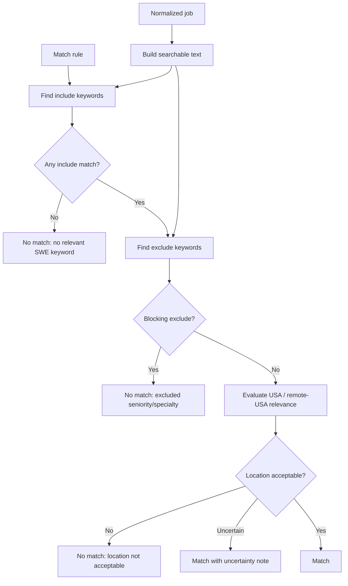

# Job Watcher Matching Design

This document captures the Phase 4 deterministic matching design for the
company job watcher.

## Status

Complete

## Design Goals

- Match relevant USA-based SWE roles without using AI or agentic browsing.
- Keep matching deterministic, explainable, and easy to test.
- Prefer surfacing plausible matches over silently dropping uncertain jobs.
- Keep source adapters free of user-specific matching decisions.
- Return structured reasons for both matches and exclusions.

## Inputs

The matcher should evaluate a normalized job plus one active match rule.

```java
record JobMatchInput(
    NormalizedJob job,
    JobMatchRuleConfig rule
) {}
```

Runtime rule shape:

```java
record JobMatchRuleConfig(
    UUID id,
    Optional<UUID> companyId,
    List<String> includeKeywords,
    List<String> excludeKeywords,
    List<String> includeCountries,
    List<String> includeLocations,
    RemotePreference remotePreference,
    boolean enabled
) {}
```

`companyId` is optional. A missing `companyId` means the rule is global for the
user; a present `companyId` scopes the rule to one company.

The matcher should load active rules from Postgres. Default keyword lists are
MVP seed values for `job_match_rules`, not permanent hardcoded product logic.
A later frontend should let the user edit these rules.

Text matching should inspect a normalized searchable string built from:

- title
- department
- job category
- experience level
- location
- country
- description snippet

Title should carry the most weight because it is usually the clearest signal.

## Output

Matching should return a structured result that can be logged, tested, and later
included in Discord alerts.

```java
record JobMatchResult(
    boolean matched,
    List<String> matchedKeywords,
    List<String> excludedKeywords,
    String locationReason,
    String seniorityReason,
    String specialtyReason,
    String explanation
) {}
```

`matched` should be false if required include/location checks fail or if an
exclude keyword blocks the job.

## Matching Flow



## Default Include Keywords

Initial MVP seed include keywords:

- software engineer
- software developer
- frontend
- front-end
- front end
- full stack
- full-stack
- react
- typescript
- javascript
- ui
- product engineer
- application engineer
- internal tools
- platform engineer

Include matching rules:

- Load include keywords from active `job_match_rules`.
- Normalize both job text and keywords to lowercase.
- Collapse repeated whitespace.
- Treat `front-end`, `front end`, and `frontend` as equivalent concepts.
- Prefer phrase matching over single-token matching where possible.
- Require at least one include keyword.

## Default Exclude Keywords

Initial MVP seed exclude keywords:

- staff
- principal
- distinguished
- director
- manager
- mobile-only
- ios
- android
- embedded
- firmware
- devops
- sre
- data scientist
- machine learning engineer
- internship
- new grad

Exclude matching rules:

- Load exclude keywords from active `job_match_rules`.
- Exclude if a blocking keyword appears in the title.
- Exclude if a blocking keyword appears strongly in category, department,
  experience level, or description snippet.
- Avoid overmatching ordinary words. For example, `manager` should block
  `Engineering Manager`, not every description that says "work with product
  managers."
- Store `excludedKeywords` in the result even when only one term blocks the job.

## Seniority Rules

Default behavior:

- `Senior Software Engineer` is allowed.
- `Lead Software Engineer` is allowed but should be lower confidence or
  configurable later.
- `Staff`, `Principal`, `Distinguished`, `Director`, and `Manager` are excluded
  by default.
- `Internship` and `New Grad` are excluded by default.

Reasoning:

The user is targeting relevant SWE roles where a warm referral is likely useful.
Senior roles can still fit. Staff/principal/director/manager roles are likely
too senior or a different track.

## Specialty Rules

Default behavior:

- Frontend, full-stack, product engineering, internal tools, developer
  experience, and application engineering roles are relevant.
- Platform engineering can be relevant when it appears product/application
  oriented.
- DevOps/SRE-heavy, mobile-only, embedded, firmware, data science, and pure ML
  engineering roles are excluded by default.
- AI tooling and developer tooling roles can match if they are real software
  engineering roles.

## USA And Remote-USA Rules

Country normalization:

- `US`, `USA`, `United States`, and recognizable US state/city locations should
  count as United States.
- If the adapter can determine a country, store it on `NormalizedJob.country`.
- If country cannot be determined, use `UNKNOWN` or null and evaluate raw
  location text.

Remote matching:

- Include `Remote - United States`, `Remote US`, `US Remote`, and similar text.
- Include remote roles that list US states or say candidates must be based in
  the United States.
- Do not include globally remote roles that clearly exclude the United States.
- For ambiguous `Remote` without country, prefer match with uncertainty rather
  than silently dropping the role.

Location outcomes:

- `ACCEPTED_US`: location appears USA-based.
- `ACCEPTED_REMOTE_US`: remote role appears open to US candidates.
- `UNCERTAIN`: location is ambiguous but not clearly out of scope.
- `REJECTED_NON_US`: location is clearly outside the USA and not remote-USA.

MVP behavior:

- `ACCEPTED_US` and `ACCEPTED_REMOTE_US` should match if keyword/seniority rules
  pass.
- `UNCERTAIN` should match with a clear uncertainty note.
- `REJECTED_NON_US` should not match.

## Explanation Rules

Every result should include a concise explanation.

Matched example:

```text
Matched because title contains Software Engineer and location appears USA-based.
No excluded seniority or specialty keywords found.
```

Uncertain match example:

```text
Matched with uncertainty because title contains Frontend Engineer, but location
is listed only as Remote and country could not be confirmed.
```

Excluded example:

```text
Excluded because title contains Principal, which is above the user's target
seniority.
```

Wrong-location example:

```text
Excluded because title contains Software Engineer but location is Bengaluru,
India and no remote-USA signal was found.
```

## Rule Precedence

1. Disabled rule means no match evaluation.
2. Missing include keyword means no match.
3. Blocking seniority/specialty exclude means no match.
4. Clearly non-USA location means no match.
5. Ambiguous remote/location can match with uncertainty.
6. Otherwise, match.

## Testing Strategy

Use table-driven unit tests for the matcher.

Required examples:

- Software Engineer in McLean, VA matches.
- Senior Software Engineer in New York, NY matches.
- Principal Software Engineer in McLean, VA is excluded.
- Staff Software Engineer remote is excluded.
- Frontend Engineer Remote - US matches.
- Frontend Engineer Remote with unknown country matches with uncertainty.
- Software Engineer in Bengaluru is excluded.
- iOS Engineer in San Francisco is excluded.
- Platform Engineer with product/application wording matches.
- SRE or DevOps-heavy role is excluded.
- Data Scientist is excluded.
- Machine Learning Engineer is excluded by default.
- New Grad Software Engineer is excluded.

## Boundary With Later Phases

This phase defines matching only.

It does not implement:

- Discord payload formatting.
- Alert delivery.
- UI controls for editing match rules.
- AI-based scoring or summarization.
- Per-company ranking beyond company-scoped rule configuration.
