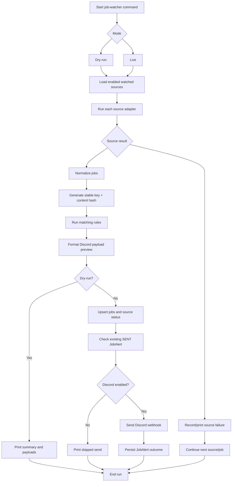

# Job Watcher Worker Design

This document captures the Phase 6 local-first worker execution design for the
company job watcher.

## Status

Complete

## Runtime Goal

The watcher should run as a local-first worker command that connects to the
existing CRM Postgres database, checks configured watched sources, updates
watcher state, and optionally sends Discord notifications.

The MVP runtime should not depend on GitHub Actions, GitHub cache, artifacts, or
committed JSON state files.

## Preferred Progression

1. Manual dry-run command.
2. Manual live run with Discord disabled by default.
3. Local scheduling through cron, systemd, Docker Compose, or a small scheduler
   process.
4. Later deployment of the same worker on an always-on machine, home server,
   VPS, or cloud host.

## Execution Modes

### Dry-Run Mode

Dry-run mode is the first command to implement.

Behavior:

- Load enabled watched sources.
- Run adapters.
- Normalize jobs.
- Generate stable keys and content hashes in memory.
- Run matching.
- Print source summaries.
- Print found jobs.
- Print matched jobs.
- Print source failures.
- Print Discord payload previews.
- Do not send Discord notifications.
- Do not mutate persisted state unless a future explicit flag opts in.
- Do not require `DISCORD_WEBHOOK_URL`.

Purpose:

Dry-run proves source ingestion, matching, and notification formatting before
the worker writes state or sends Discord messages.

### Live Manual Mode

Live manual mode is the second command to implement.

Behavior:

- Load enabled watched sources.
- Run adapters.
- Normalize jobs.
- Generate stable keys and content hashes.
- Upsert seen jobs into Postgres.
- Update source check status in Postgres.
- Run matching.
- Check existing `SENT` alerts before sending.
- Create `JobAlert` records for send attempts when Discord sending is enabled.
- Send Discord notifications only if explicitly enabled.
- Continue processing other sources/jobs when one source or notification fails.

Discord sending remains disabled unless:

```text
JOB_WATCHER_SEND_DISCORD=true
```

and `DISCORD_WEBHOOK_URL` is configured.

### Local Scheduled Mode

Local scheduling is the third step, after manual live mode works.

Supported options to document later:

- host cron
- systemd timer
- Docker Compose worker service
- a small local scheduler process

Recommended cadence:

```cron
17 */6 * * *
```

Reason:

Run every 6 hours with an offset minute instead of exactly the top of the hour.

If host cron or systemd is used, the machine must be powered on and able to
reach Postgres and the job sources.

## Command Shape

Preferred Spring Boot command shape:

```bash
cd backend
./mvnw spring-boot:run \
  -Dspring-boot.run.profiles=local \
  -Dspring-boot.run.arguments="job-watcher --dry-run"
```

Live manual mode:

```bash
cd backend
./mvnw spring-boot:run \
  -Dspring-boot.run.profiles=local \
  -Dspring-boot.run.arguments="job-watcher --live"
```

Live mode with Discord explicitly enabled:

```bash
cd backend
JOB_WATCHER_SEND_DISCORD=true \
DISCORD_WEBHOOK_URL="..." \
./mvnw spring-boot:run \
  -Dspring-boot.run.profiles=local \
  -Dspring-boot.run.arguments="job-watcher --live"
```

Possible later Docker command shape:

```bash
docker compose run --rm job-watcher --dry-run
```

If implementation discovers a better existing command pattern, follow the
repo's pattern and update this document.

## Worker Flow



## Persistence Behavior

Dry-run:

- No database mutation by default.
- Console output should include what would be written.

Live:

- Update `watched_job_sources.last_checked_at` for attempted sources.
- Update `last_successful_check_at` and clear `last_error` for successful
  sources.
- Store `last_error` for failed sources.
- Upsert `job_postings` by `(source_id, stable_key)`.
- Update `last_seen_at` and `content_hash` for existing jobs.
- Mark missing jobs `REMOVED` only after the configured safe threshold.
- Persist Discord `JobAlert` outcomes only for live send attempts.

## Idempotency And Alert Guard

Before sending Discord:

1. Find the `job_posting`.
2. Check for an existing `JobAlert` with:

```text
channel = DISCORD_WEBHOOK
status = SENT
```

3. If one exists, do not send again.

Changed content should update `content_hash` and `last_seen_at`, but should not
trigger another alert by default.

## Run Summary

Every run should print a concise summary:

- mode
- sources checked
- source successes
- source failures
- jobs found
- new jobs
- updated jobs
- removed jobs
- matched jobs
- alerts skipped
- alerts sent
- alerts failed

Dry-run should clearly label output as preview-only.

## Scheduling Notes

Cron example:

```cron
17 */6 * * * cd /path/to/Keep-In-Touch/backend && ./mvnw spring-boot:run -Dspring-boot.run.profiles=local -Dspring-boot.run.arguments="job-watcher --live"
```

Systemd timer and Docker Compose worker service can be documented after the
manual live command exists.

The worker may eventually run inside the Spring app as a scheduled job, but the
command-and-exit model is preferred for MVP clarity and easier manual testing.

## Testing Strategy

Runner tests should cover:

- Dry-run does not write to Postgres.
- Dry-run prints source summaries and payload previews.
- Source failure does not fail the entire run.
- Live mode upserts new jobs.
- Existing jobs update instead of duplicating.
- Existing `SENT` alerts block repeated sends.
- Discord is not sent unless explicitly enabled.
- Failed Discord sends are recorded safely.
- Missing jobs are not marked `REMOVED` too aggressively.

## Boundary With Later Phases

This phase defines execution behavior only.

It does not implement:

- The actual CLI command.
- Scheduler configuration files.
- Docker Compose worker service.
- Java entities or migrations.
- Discord HTTP client code.
