# Schema Design

## Table of Contents

- [Project Summary](#project-summary)
- [Key Concepts](#key-concepts)
  - [What does "first-class record" mean?](#what-does-first-class-record-mean)
  - [What are JPA entities?](#what-are-jpa-entities)
- [Product Assumptions](#product-assumptions)
  - [MVP assumptions](#mvp-assumptions)
  - [Product positioning](#product-positioning)
  - [MVP workflow](#mvp-workflow)
- [Naming Conventions](#naming-conventions)
  - [Database naming](#database-naming)
  - [Java naming](#java-naming)
- [Type Conventions](#type-conventions)
- [Entity Relationship Diagram](#entity-relationship-diagram)
- [Table Descriptions](#table-descriptions)
  - [`users`](#users)
  - [`companies`](#companies)
  - [`contacts`](#contacts)
  - [`interactions`](#interactions)
  - [`follow_ups`](#follow_ups)
- [Enum Values](#enum-values)
  - [`ContactStatus`](#contactstatus)
  - [`RelationshipType`](#relationshiptype)
  - [`InteractionType`](#interactiontype)
  - [`FollowUpStatus`](#followupstatus)
- [Relationship Notes](#relationship-notes)
  - [User ownership](#user-ownership)
  - [Contacts and companies](#contacts-and-companies)
  - [Contacts and interactions](#contacts-and-interactions)
  - [Contacts and follow-ups](#contacts-and-follow-ups)
  - [Birthdays](#birthdays)
- [Suggested Indexes](#suggested-indexes)
- [Suggested Unique Indexes](#suggested-unique-indexes)
- [MVP Query Patterns](#mvp-query-patterns)
  - [Contact list](#contact-list)
  - [Contact detail](#contact-detail)
  - [Company list](#company-list)
  - [Company detail](#company-detail)
  - [Dashboard](#dashboard)
  - [Job-search workflow examples](#job-search-workflow-examples)
- [First Vertical Slice: Companies and Contacts](#first-vertical-slice-companies-and-contacts)
- [Second Vertical Slice: Interaction Logging](#second-vertical-slice-interaction-logging)
- [Third Vertical Slice: Follow-Ups and Dashboard](#third-vertical-slice-follow-ups-and-dashboard)
- [Fourth Vertical Slice: Birthdays](#fourth-vertical-slice-birthdays)
- [Future Schema Ideas](#future-schema-ideas)
  - [Tags](#tags)
  - [Custom personal dates](#custom-personal-dates)
  - [Contact employment history](#contact-employment-history)
  - [Opportunities or job applications](#opportunities-or-job-applications)
  - [Recurring follow-ups](#recurring-follow-ups)
  - [Interaction markdown](#interaction-markdown)
  - [Interaction attachments](#interaction-attachments)
  - [CSV import/export](#csv-importexport)
  - [Reminders and notifications](#reminders-and-notifications)
  - [Soft deletion](#soft-deletion)
- [Open Schema Questions](#open-schema-questions)
- [Current Product Decisions](#current-product-decisions)
- [Initial Recommendation](#initial-recommendation)

## Project Summary

This app is a personal CRM for keeping track of relationships, conversations, birthdays, companies, and follow-ups.

The goal is not to build a sales CRM. The goal is to build a lightweight relationship memory tool that helps a user answer:

- Who do I know?
- Where do they work?
- How do I know them?
- What have we talked about?
- When should I follow up?
- Whose birthday or important personal date should I remember?
- Who am I accidentally letting go cold?

The first version should be general enough to support normal personal relationship tracking, but job-search-friendly enough to support networking, alumni outreach, recruiter conversations, referrals, coffee chats, and target-company tracking.

## Key Concepts

## What does "first-class record" mean?

A first-class record is something important enough to get its own table, ID, lifecycle, and usually its own backend endpoints.

For example, a follow-up could be modeled as a simple field on a contact:

```text
contacts.next_follow_up_at
```

That would only tell us the next follow-up date.

Instead, in this app, follow-ups are first-class records:

```text
follow_ups
- id
- contact_id
- interaction_id
- due_at
- status
- reason
- completed_at
- created_at
- updated_at
```

That means the app can preserve follow-up history over time.

A first-class follow-up can be created, edited, completed, cancelled, listed on a dashboard, and connected back to a contact or interaction.

The same idea applies to future job applications. If job applications become first-class records, they would get their own table such as `job_applications`. If not, they might just be notes, tags, or interactions on a contact.

## What are JPA entities?

JPA stands for Java Persistence API. In a Spring Boot app, JPA entities are Java classes that map to database tables.

For example, the database might have a table called `contacts`:

```sql
CREATE TABLE contacts (
    id UUID PRIMARY KEY,
    first_name VARCHAR(100) NOT NULL,
    email VARCHAR(255)
);
```

The Spring Boot backend would have a Java entity class like:

```java
@Entity
@Table(name = "contacts")
public class Contact {
    @Id
    private UUID id;

    private String firstName;

    private String email;
}
```

The database stores rows. The Java app works with objects.

JPA/Hibernate handles the mapping between those two worlds.

For this project:

- Flyway creates and updates the database tables.
- JPA entities represent those tables in Java.
- Spring Data repositories help query and save those entities.

## Product Assumptions

### MVP assumptions

- The app is for a single user at first, but the schema should support multiple users later.
- A `users` table will exist even if real authentication is not implemented in the first version.
- Contacts belong to users.
- Companies belong to users.
- A contact may optionally be associated with one current company.
- Companies are part of the MVP.
- A contact can have many interactions.
- Interactions can be edited after creation.
- A contact can have many follow-ups over time.
- A contact should only have one open follow-up at a time in MVP.
- A follow-up always belongs to a contact.
- A follow-up may optionally be attached to the interaction that created it.
- Follow-ups require a specific due date and time.
- Birthdays are part of the MVP.
- Custom personal dates are not part of the MVP, but should be supported later.
- Tags are not part of the MVP.
- Email should be unique per user when provided.
- Contacts do not need to have an email, phone number, or LinkedIn URL.
- Companies are not required for contacts.
- `contacts.next_follow_up_at` and `contacts.last_interaction_at` are stored as shortcut fields for easier dashboard queries.
- The source of truth for interaction history is the `interactions` table.
- The source of truth for follow-up history is the `follow_ups` table.
- The first version will not include email sync, calendar sync, LinkedIn scraping, AI-generated outreach, teams, billing, mobile apps, CSV import/export, tags, or markdown notes.

### Product positioning

The app should feel more like:

> A personal relationship tracker focused on context and next actions.

It should not feel like:

> A sales pipeline tool for turning people into leads.

### MVP workflow

The first complete workflow should be:

1. Create a company.
2. View company details.
3. Create a contact.
4. Optionally associate that contact with a company.
5. View all contacts.
6. Open a contact detail page.
7. Add or view the contact's birthday.
8. Log an interaction.
9. Add a follow-up.
10. See due or overdue follow-ups on a dashboard.
11. Mark a follow-up as complete.

## Naming Conventions

### Database naming

- Table names use plural snake_case.
- Column names use snake_case.
- Primary keys are named `id`.
- Foreign keys use the referenced singular table name plus `_id`.
- Timestamps use `_at`.
- Boolean fields use `is_`, `has_`, or another clear true/false name if needed later.

Examples:

```sql
contacts
follow_ups
created_at
updated_at
contact_id
user_id
```

### Java naming

- Java classes use PascalCase.
- Java fields use camelCase.
- Java enums use PascalCase class names and UPPER_SNAKE_CASE enum values.
- JPA entities should map to database tables.

Examples:

```java
Contact
FollowUp
createdAt
updatedAt
ContactStatus.WAITING_FOR_RESPONSE
```

## Type Conventions

This project uses Postgres for the database and Java/Spring Boot for the backend.

Common type mappings:

| Concept | Postgres Type | Java Type |
|---|---|---|
| ID | `UUID` | `UUID` |
| Short text | `VARCHAR(n)` | `String` |
| Long text / notes | `TEXT` | `String` |
| Date + time | `TIMESTAMPTZ` | `OffsetDateTime` |
| Date only | `DATE` | `LocalDate` |
| Month/day values | `SMALLINT` | `Short` or `Integer` |
| True/false | `BOOLEAN` | `Boolean` or `boolean` |
| Status/type values | `VARCHAR(50)` | Java `enum` |
| Count | `INTEGER` | `Integer` or `int` |

For MVP, status and type values will be stored as `VARCHAR(50)` in Postgres and represented as Java enums in the backend.

Postgres enums are intentionally avoided in the first version to keep migrations simpler while the product model is still changing.

## Entity Relationship Diagram

```mermaid
erDiagram
    USERS {
        UUID id PK
        VARCHAR email
        VARCHAR display_name
        TIMESTAMPTZ created_at
        TIMESTAMPTZ updated_at
    }

    COMPANIES {
        UUID id PK
        UUID user_id FK
        VARCHAR name
        VARCHAR website
        VARCHAR industry
        VARCHAR location
        TEXT notes
        TIMESTAMPTZ created_at
        TIMESTAMPTZ updated_at
    }

    CONTACTS {
        UUID id PK
        UUID user_id FK
        UUID company_id FK
        VARCHAR first_name
        VARCHAR last_name
        VARCHAR preferred_name
        VARCHAR role_title
        VARCHAR location
        VARCHAR linkedin_url
        VARCHAR email
        VARCHAR phone
        VARCHAR relationship_type
        VARCHAR status
        VARCHAR source
        TEXT notes
        SMALLINT birthday_month
        SMALLINT birthday_day
        INTEGER birthday_year
        TIMESTAMPTZ last_interaction_at
        TIMESTAMPTZ next_follow_up_at
        TIMESTAMPTZ created_at
        TIMESTAMPTZ updated_at
    }

    INTERACTIONS {
        UUID id PK
        UUID contact_id FK
        VARCHAR interaction_type
        TIMESTAMPTZ occurred_at
        TEXT summary
        TEXT outcome
        TIMESTAMPTZ created_at
        TIMESTAMPTZ updated_at
    }

    FOLLOW_UPS {
        UUID id PK
        UUID contact_id FK
        UUID interaction_id FK
        TIMESTAMPTZ due_at
        VARCHAR status
        TEXT reason
        TIMESTAMPTZ completed_at
        TIMESTAMPTZ created_at
        TIMESTAMPTZ updated_at
    }

    USERS ||--o{ CONTACTS : owns
    USERS ||--o{ COMPANIES : owns

    COMPANIES ||--o{ CONTACTS : employs

    CONTACTS ||--o{ INTERACTIONS : has
    CONTACTS ||--o{ FOLLOW_UPS : has

    INTERACTIONS ||--o{ FOLLOW_UPS : may_create
```



## Table Descriptions

## `users`

Stores app users.

Even though MVP may only have one local user, this table exists so the schema can support real authentication and multiple users later.

### Columns

| Column | Type | Required | Notes |
|---|---|---:|---|
| `id` | `UUID` | yes | Primary key |
| `email` | `VARCHAR(255)` | yes | Unique email address |
| `display_name` | `VARCHAR(255)` | yes | User-facing name |
| `created_at` | `TIMESTAMPTZ` | yes | Creation timestamp |
| `updated_at` | `TIMESTAMPTZ` | yes | Last update timestamp |

### Constraints

- `id` primary key
- `email` unique
- `email` not null
- `display_name` not null

### Notes

For the first version, the app can seed one default user and attach all records to that user.

Later, this table can connect to authentication.

---

## `companies`

Stores companies, organizations, schools, communities, or other groups connected to contacts.

This is useful for job-search workflows because many contacts are organized around companies.

Examples:

- Vanguard
- Mercury
- Capital One
- Galvanize
- Local Code & Coffee
- Chattanooga startup community

### Columns

| Column | Type | Required | Notes |
|---|---|---:|---|
| `id` | `UUID` | yes | Primary key |
| `user_id` | `UUID` | yes | Owner |
| `name` | `VARCHAR(255)` | yes | Company or organization name |
| `website` | `VARCHAR(500)` | no | Optional website |
| `industry` | `VARCHAR(255)` | no | Optional industry/category |
| `location` | `VARCHAR(255)` | no | Optional location |
| `notes` | `TEXT` | no | General notes |
| `created_at` | `TIMESTAMPTZ` | yes | Creation timestamp |
| `updated_at` | `TIMESTAMPTZ` | yes | Last update timestamp |

### Constraints

- `id` primary key
- `user_id` references `users(id)`
- `name` not null
- Recommended unique company name per user: `(user_id, lower(name))`

### Notes

Companies belong to users because two users may define and organize companies differently.

In MVP, a contact can have one current company through `contacts.company_id`.

Company management is part of the MVP. A user should be able to create a company, view company details, and see contacts associated with that company.

Later, if we want employment history, we can add a `contact_companies` table.

---

## `contacts`

Stores people the user wants to remember, track, or follow up with.

This is the core table of the app.

### Columns

| Column | Type | Required | Notes |
|---|---|---:|---|
| `id` | `UUID` | yes | Primary key |
| `user_id` | `UUID` | yes | Owner |
| `company_id` | `UUID` | no | Current company or organization |
| `first_name` | `VARCHAR(100)` | yes | Contact first name |
| `last_name` | `VARCHAR(100)` | no | Contact last name |
| `preferred_name` | `VARCHAR(100)` | no | Nickname or preferred name |
| `role_title` | `VARCHAR(255)` | no | Job title or role |
| `location` | `VARCHAR(255)` | no | City, state, remote, etc. |
| `linkedin_url` | `VARCHAR(500)` | no | LinkedIn profile URL |
| `email` | `VARCHAR(255)` | no | Email address |
| `phone` | `VARCHAR(50)` | no | Phone number |
| `relationship_type` | `VARCHAR(50)` | yes | How the user knows this person |
| `status` | `VARCHAR(50)` | yes | Current relationship/outreach status |
| `source` | `VARCHAR(255)` | no | Where this contact came from |
| `notes` | `TEXT` | no | General notes |
| `birthday_month` | `SMALLINT` | no | Birthday month, 1 through 12 |
| `birthday_day` | `SMALLINT` | no | Birthday day, 1 through 31 |
| `birthday_year` | `INTEGER` | no | Optional birth year, if known |
| `last_interaction_at` | `TIMESTAMPTZ` | no | Cached date of most recent interaction |
| `next_follow_up_at` | `TIMESTAMPTZ` | no | Cached date of next open follow-up |
| `created_at` | `TIMESTAMPTZ` | yes | Creation timestamp |
| `updated_at` | `TIMESTAMPTZ` | yes | Last update timestamp |

### Constraints

- `id` primary key
- `user_id` references `users(id)`
- `company_id` references `companies(id)`
- `first_name` not null
- `last_name` nullable
- `relationship_type` not null
- `status` not null
- Email unique per user when provided
- Birthday month should be between 1 and 12 when provided
- Birthday day should be between 1 and 31 when provided
- Birthday month and birthday day should either both be present or both be null

### Notes

`last_name` is intentionally optional.

Contacts are not required to have an email, phone number, or LinkedIn URL.

`source` should be a free text field because it can represent many different things, such as LinkedIn, a conference, a friend introduction, Galvanize, a local meetup, a Slack community, or a job posting.

Birthday is modeled as separate month/day/year fields instead of a single `DATE` because users often know someone's birthday month and day without knowing the year.

`last_interaction_at` and `next_follow_up_at` are cached fields.

They can be recalculated from `interactions` and `follow_ups`, but storing them on `contacts` makes dashboard and contact-list queries easier.

When an interaction is created or updated, the backend should update `contacts.last_interaction_at`.

When an open follow-up is created, completed, rescheduled, or cancelled, the backend should update `contacts.next_follow_up_at`.

---

## `interactions`

Stores historical interactions with a contact.

Examples:

- LinkedIn message
- Email
- Coffee chat
- Phone call
- Slack message
- In-person conversation
- Referral conversation

### Columns

| Column | Type | Required | Notes |
|---|---|---:|---|
| `id` | `UUID` | yes | Primary key |
| `contact_id` | `UUID` | yes | Related contact |
| `interaction_type` | `VARCHAR(50)` | yes | Type of interaction |
| `occurred_at` | `TIMESTAMPTZ` | yes | When the interaction happened |
| `summary` | `TEXT` | yes | What happened |
| `outcome` | `TEXT` | no | Result or next-step context |
| `created_at` | `TIMESTAMPTZ` | yes | Creation timestamp |
| `updated_at` | `TIMESTAMPTZ` | yes | Last update timestamp |

### Constraints

- `id` primary key
- `contact_id` references `contacts(id)`
- `interaction_type` not null
- `occurred_at` not null
- `summary` not null

### Notes

The interaction timeline is one of the most important features of the app.

This table answers:

- When did I last talk to this person?
- What did we talk about?
- What did they say?
- Did they offer help?
- Did I promise to follow up?

Interactions should be editable after creation.

Markdown support for summaries would be nice, but it is not part of the MVP.

---

## `follow_ups`

Stores reminders or next actions related to a contact.

A contact can have many follow-ups over time, but only one open follow-up at a time in MVP.

Examples:

- Follow up next Friday.
- Send resume after coffee chat.
- Check back after application closes.
- Thank them for referral.
- Pause outreach for now.

### Columns

| Column | Type | Required | Notes |
|---|---|---:|---|
| `id` | `UUID` | yes | Primary key |
| `contact_id` | `UUID` | yes | Related contact |
| `interaction_id` | `UUID` | no | Optional interaction that created this follow-up |
| `due_at` | `TIMESTAMPTZ` | yes | Exact date and time when follow-up is due |
| `status` | `VARCHAR(50)` | yes | Open/completed/cancelled |
| `reason` | `TEXT` | no | Why this follow-up exists |
| `completed_at` | `TIMESTAMPTZ` | no | When it was completed |
| `created_at` | `TIMESTAMPTZ` | yes | Creation timestamp |
| `updated_at` | `TIMESTAMPTZ` | yes | Last update timestamp |

### Constraints

- `id` primary key
- `contact_id` references `contacts(id)`
- `interaction_id` references `interactions(id)`
- `due_at` not null
- `status` not null
- Only one open follow-up per contact

### Notes

Follow-ups are separate records so the app can preserve history.

The dashboard should primarily query this table for open, due, and overdue follow-ups.

A follow-up always belongs to a contact.

A follow-up may optionally be attached to an interaction. This supports workflows like:

> I had a coffee chat with Sarah and created a follow-up from that conversation.

For MVP, snoozing can be modeled as updating the `due_at` value on an open follow-up. A separate `SNOOZED` status is not needed yet.

When a follow-up changes state, the backend should update `contacts.next_follow_up_at` based on the next open follow-up for that contact.

## Enum Values

These values should likely be represented as Java enums and stored in Postgres as `VARCHAR(50)`.

## `ContactStatus`

Describes the current state of the relationship or outreach.

```text
NEW
REACHED_OUT
WAITING_FOR_RESPONSE
CONVERSATION_SCHEDULED
ACTIVE
DORMANT
PAUSED
DO_NOT_CONTACT
```

### Notes

| Value | Meaning |
|---|---|
| `NEW` | Contact has been added but no outreach/action has happened yet |
| `REACHED_OUT` | User has sent an initial message |
| `WAITING_FOR_RESPONSE` | User is waiting for the contact to respond |
| `CONVERSATION_SCHEDULED` | A meeting or chat is scheduled |
| `ACTIVE` | There has been a meaningful recent interaction |
| `DORMANT` | Relationship exists but has gone cold |
| `PAUSED` | User intentionally does not want to act right now |
| `DO_NOT_CONTACT` | User does not want to contact this person |

## `RelationshipType`

Describes how the user knows the contact.

```text
FRIEND
FORMER_COWORKER
ALUMNI
RECRUITER
MENTOR
COMMUNITY
PROFESSIONAL
OTHER
```

### Notes

This should stay broad in MVP.

More specific labels can eventually be handled through tags.

## `InteractionType`

Describes how the interaction happened.

```text
LINKEDIN_MESSAGE
EMAIL
COFFEE_CHAT
PHONE_CALL
SLACK
IN_PERSON
APPLICATION_REFERRAL
OTHER
```

## `FollowUpStatus`

Describes the state of a follow-up.

```text
OPEN
COMPLETED
CANCELLED
```

### Notes

For MVP, snoozing is not a separate status.

Snoozing means changing the `due_at` value while the follow-up remains `OPEN`.

## Relationship Notes

## User ownership

Most major records should belong to a user, either directly or indirectly.

Direct ownership:

- `users -> contacts`
- `users -> companies`

Indirect ownership:

- `contacts -> interactions`
- `contacts -> follow_ups`

Since interactions and follow-ups belong to contacts, and contacts belong to users, we do not need `user_id` on interactions or follow-ups for MVP.

If query performance or authorization checks become annoying later, we can consider adding `user_id` to those tables too.

## Contacts and companies

A contact can have zero or one current company.

This is intentionally simple.

A company can have many contacts.

Company management is part of MVP because job-search and networking workflows often revolve around companies.

A more complete model could support employment history:

```text
contact_companies
- contact_id
- company_id
- role_title
- started_at
- ended_at
- is_current
```

That is not needed for MVP.

## Contacts and interactions

A contact can have many interactions.

An interaction belongs to exactly one contact.

Interactions should be editable.

If deletion is implemented, it should probably be a normal delete in MVP and soft delete later if needed.

## Contacts and follow-ups

A contact can have many follow-ups over time.

A follow-up belongs to exactly one contact.

A follow-up can optionally belong to one interaction.

In MVP, a contact should only have one open follow-up at a time.

`contacts.next_follow_up_at` should represent that open follow-up's due date.

## Birthdays

Birthdays are part of MVP.

They are stored on contacts as separate month, day, and optional year fields.

This supports cases where the user knows someone's birthday but does not know the birth year.

Future arbitrary personal dates should use a separate table, not more columns on contacts.

## Suggested Indexes

These indexes should be considered for the first Flyway migration or added shortly after.

```sql
CREATE INDEX idx_companies_user_id
    ON companies(user_id);

CREATE INDEX idx_contacts_user_id
    ON contacts(user_id);

CREATE INDEX idx_contacts_company_id
    ON contacts(company_id);

CREATE INDEX idx_contacts_status
    ON contacts(status);

CREATE INDEX idx_contacts_next_follow_up_at
    ON contacts(next_follow_up_at);

CREATE INDEX idx_contacts_last_interaction_at
    ON contacts(last_interaction_at);

CREATE INDEX idx_contacts_birthday_month_day
    ON contacts(birthday_month, birthday_day);

CREATE INDEX idx_interactions_contact_id
    ON interactions(contact_id);

CREATE INDEX idx_interactions_occurred_at
    ON interactions(occurred_at);

CREATE INDEX idx_follow_ups_contact_id
    ON follow_ups(contact_id);

CREATE INDEX idx_follow_ups_interaction_id
    ON follow_ups(interaction_id);

CREATE INDEX idx_follow_ups_status
    ON follow_ups(status);

CREATE INDEX idx_follow_ups_due_at
    ON follow_ups(due_at);
```

## Suggested Unique Indexes

Email should be unique per user when provided.

In Postgres, nullable unique values need special care. Since contacts are not required to have an email, we can use a partial unique index:

```sql
CREATE UNIQUE INDEX uq_contacts_user_email_when_present
    ON contacts(user_id, lower(email))
    WHERE email IS NOT NULL;
```

This allows multiple contacts without email addresses, but prevents the same user from creating two contacts with the same email.

For one open follow-up per contact, we can use another partial unique index:

```sql
CREATE UNIQUE INDEX uq_follow_ups_one_open_per_contact
    ON follow_ups(contact_id)
    WHERE status = 'OPEN';
```

## MVP Query Patterns

The schema should support these early queries.

## Contact list

Show all contacts for the current user.

Possible filters:

- Status
- Company
- Search by name
- Next follow-up due
- Last interaction date
- Birthday month

## Contact detail

Show:

- Contact profile
- Company
- Birthday
- Interaction timeline
- Open follow-up
- Completed follow-ups

## Company list

Show all companies for the current user.

Useful fields:

- Company name
- Location
- Number of contacts
- Most recent contact interaction
- Next follow-up among contacts at that company

## Company detail

Show:

- Company profile
- Notes
- Contacts at that company
- Recent interactions with people at that company
- Upcoming follow-ups connected to people at that company

## Dashboard

Show:

- Follow-ups due today
- Overdue follow-ups
- Upcoming follow-ups
- Upcoming birthdays
- Recently contacted people
- Contacts with no next action
- Dormant contacts

## Job-search workflow examples

Even though the schema is general, it should support job-search use cases.

Examples:

- Track alumni at target companies.
- Log LinkedIn outreach.
- Record coffee chat notes.
- Mark contacts as waiting for response.
- Add follow-up reminders.
- See who offered a referral.
- See which companies have warm contacts.

## First Vertical Slice: Companies and Contacts

The first vertical slice should establish the basic relationship between companies and contacts.

### Backend endpoints

```text
POST /companies
GET /companies
GET /companies/{id}

POST /contacts
GET /contacts
GET /contacts/{id}
```

### Frontend screens

```text
Company list
Company detail page
Create company form
Contact list
Create contact form
Contact detail page
```

### Database tables involved

```text
users
companies
contacts
```

### Success criteria

A user can:

1. Create a company.
2. View the company in a company list.
3. Open the company detail page.
4. Create a contact.
5. Optionally associate the contact with a company.
6. See the contact in a contact list.
7. Open the contact detail page.
8. See company information on the contact detail page.
9. See contacts associated with a company on the company detail page.
10. Refresh the app and see all data still persisted in Postgres.

## Second Vertical Slice: Interaction Logging

The second vertical slice should be interaction logging.

### Backend endpoints

```text
POST /contacts/{id}/interactions
GET /contacts/{id}/interactions
PATCH /interactions/{id}
```

### Frontend screens

```text
Interaction form on contact detail page
Interaction timeline on contact detail page
Edit interaction form
```

### Success criteria

A user can:

1. Add an interaction to a contact.
2. View that interaction in the contact timeline.
3. Edit the interaction summary or outcome.
4. See the contact's `last_interaction_at` updated.

## Third Vertical Slice: Follow-Ups and Dashboard

The third vertical slice should be follow-ups.

### Backend endpoints

```text
POST /contacts/{id}/follow-ups
GET /follow-ups/due
PATCH /follow-ups/{id}
PATCH /follow-ups/{id}/complete
PATCH /follow-ups/{id}/cancel
```

### Frontend screens

```text
Dashboard
Add follow-up form
Open follow-up display on contact detail page
Complete follow-up button
Cancel follow-up button
```

### Success criteria

A user can:

1. Add a follow-up to a contact.
2. Optionally create a follow-up from an interaction.
3. See the follow-up on the dashboard when it is due.
4. Reschedule the follow-up by changing its due date/time.
5. Mark it complete.
6. Cancel it.
7. See the contact's `next_follow_up_at` updated.
8. Be prevented from creating multiple open follow-ups for the same contact.

## Fourth Vertical Slice: Birthdays

The fourth vertical slice should make birthdays visible and useful.

### Backend endpoints

Birthdays can be handled through the contact endpoints at first:

```text
POST /contacts
GET /contacts
GET /contacts/{id}
PATCH /contacts/{id}
```

Optional dashboard-specific endpoint:

```text
GET /contacts/birthdays/upcoming
```

### Frontend screens

```text
Birthday fields on contact form
Birthday display on contact detail page
Upcoming birthdays on dashboard
```

### Success criteria

A user can:

1. Add a birthday month and day to a contact.
2. Optionally add a birthday year.
3. View the birthday on the contact detail page.
4. See upcoming birthdays on the dashboard.

## Future Schema Ideas

These are intentionally out of scope for MVP.

## Tags

Tags are useful, but they are outside MVP.

When added, tags could support flexible grouping such as:

- Galvanize
- Hack Reactor
- Vanguard
- Recruiter
- Referral possible
- Frontend
- Chattanooga
- Coffee chat
- Warm connection

Possible tables:

```text
tags
- id
- user_id
- name
- color_hex
- created_at
- updated_at

contact_tags
- contact_id
- tag_id
- created_at
```

Tag colors are optional.

If tags are added, colors may be useful in the UI, but they are not required for the first version of tagging.

## Custom personal dates

Birthdays are part of MVP, but arbitrary personal dates are not.

Future custom dates could use:

```text
contact_dates
- id
- contact_id
- label
- month
- day
- year
- date_type
- notes
- created_at
- updated_at
```

Examples:

- Work anniversary
- Wedding anniversary
- Graduation date
- First met date
- Important life event

## Contact employment history

If one current company becomes too limited:

```text
contact_companies
- contact_id
- company_id
- role_title
- started_at
- ended_at
- is_current
- created_at
- updated_at
```

## Opportunities or job applications

If the app becomes more job-search-specific, job applications could become first-class records.

That would mean adding a table like:

```text
job_applications
- id
- user_id
- company_id
- title
- url
- status
- applied_at
- notes
- created_at
- updated_at
```

Possible join table:

```text
job_application_contacts
- job_application_id
- contact_id
- relationship_to_application
- created_at
```

This is not part of MVP.

## Recurring follow-ups

If recurring reminders become important:

```text
follow_up_rules
- id
- contact_id
- frequency
- interval_count
- next_due_at
- paused_at
- created_at
- updated_at
```

## Interaction markdown

Markdown support for interaction summaries may be added later.

This likely does not require a schema change if summaries remain stored as `TEXT`.

The frontend can choose to render the summary as markdown later.

## Interaction attachments

If users want to save files, screenshots, or documents:

```text
interaction_attachments
- id
- interaction_id
- file_name
- file_url
- content_type
- created_at
```

## CSV import/export

CSV import/export is a stretch goal.

Possible import tables:

```text
import_batches
- id
- user_id
- source
- status
- created_at
- completed_at
```

```text
imported_contacts
- id
- import_batch_id
- contact_id
- raw_payload
- status
- created_at
```

## Reminders and notifications

If the app sends emails or push notifications:

```text
notifications
- id
- user_id
- follow_up_id
- channel
- status
- scheduled_at
- sent_at
- created_at
```

## Soft deletion

If deleted contacts need to be recoverable:

```text
deleted_at TIMESTAMPTZ
```

could be added to:

- contacts
- companies
- interactions
- follow_ups

This is not needed for MVP.

## Open Schema Questions

These need product decisions before or during implementation.

1. Should company names be unique per user?
2. Should contacts support multiple email addresses later?
3. Should contacts support multiple phone numbers later?
4. Should the company detail page show interactions across all contacts at that company?
5. Should completing a follow-up automatically prompt the user to log an interaction?
6. Should cancelled follow-ups remain visible in contact history?
7. Should birthdays without years be displayed differently from birthdays with years?
8. Should the app remind the user before birthdays, or only show them on the dashboard?
9. Should contacts have a `met_at` or `first_met_at` field later?
10. Should follow-up reminders eventually support recurrence?
11. Should tags be added immediately after the MVP or later?
12. Should job applications become first-class records later?
13. Should source eventually become its own table if common sources repeat often?

## Current Product Decisions

These decisions have been made for MVP:

1. `last_name` is not required.
2. Email should be unique per user when provided.
3. Contacts do not need to have email, phone, or LinkedIn URL.
4. Companies are not required for contacts.
5. Contacts should only have one open follow-up at a time in MVP.
6. Follow-ups require a specific due date and time.
7. Interaction summaries will not support markdown in MVP.
8. Birthdays are part of MVP.
9. Custom personal dates are post-MVP.
10. Tags are post-MVP.
11. Relationship strength/priority is not part of MVP.
12. CSV import/export is a stretch goal.
13. Job applications may become first-class records later, but not in MVP.
14. Interactions should be editable after creation.
15. Follow-ups can belong to a contact and optionally attach to an interaction.
16. `source` is free text.

## Initial Recommendation

Start with this schema as the MVP foundation.

Build in this order:

1. Users seed/default user.
2. Companies.
3. Contacts.
4. Interactions.
5. Follow-ups.
6. Birthdays/dashboard visibility.

Avoid adding tags, job applications, recurring reminders, imports, auth, notifications, markdown, or custom personal dates until the core relationship workflow works.

The core MVP is complete when a user can:

1. Create a company.
2. Create a contact.
3. Associate a contact with a company.
4. Add a birthday to a contact.
5. Log an interaction.
6. Edit an interaction.
7. Schedule a follow-up.
8. View due follow-ups on a dashboard.
9. View upcoming birthdays on a dashboard.
10. Mark follow-ups complete.
