# Schema Design

## Table of Contents

- [Project Summary](#project-summary)
- [Key Concepts](#key-concepts)
  - [What does "first-class record" mean?](#what-does-first-class-record-mean)
  - [What are JPA entities?](#what-are-jpa-entities)
- [Product Assumptions](#product-assumptions)
  - [MVP Assumptions](#mvp-assumptions)
  - [Product Positioning](#product-positioning)
  - [MVP Workflow](#mvp-workflow)
- [Naming Conventions](#naming-conventions)
  - [Database Naming](#database-naming)
  - [Java Naming](#java-naming)
  - [GraphQL Naming](#graphql-naming)
- [Type Conventions](#type-conventions)
- [Entity Relationship Diagram](#entity-relationship-diagram)
- [Table Descriptions](#table-descriptions)
  - [`users`](#users)
  - [`companies`](#companies)
  - [`contacts`](#contacts)
  - [`interactions`](#interactions)
  - [`follow_ups`](#follow_ups)
- [Enum Values](#enum-values)
  - [`ContactStatus`](#contactstatus)
  - [`RelationshipType`](#relationshiptype)
  - [`InteractionType`](#interactiontype)
  - [`FollowUpStatus`](#followupstatus)
- [Relationship Notes](#relationship-notes)
  - [User Ownership](#user-ownership)
  - [Contacts and Companies](#contacts-and-companies)
  - [Contacts and Interactions](#contacts-and-interactions)
  - [Contacts and Follow-Ups](#contacts-and-follow-ups)
  - [Follow-Ups and Interactions](#follow-ups-and-interactions)
  - [Birthdays](#birthdays)
- [Suggested Indexes](#suggested-indexes)
- [Suggested Unique Indexes](#suggested-unique-indexes)
- [MVP Query Patterns](#mvp-query-patterns)
  - [Contact List](#contact-list)
  - [Contact Detail](#contact-detail)
  - [Company List](#company-list)
  - [Company Detail](#company-detail)
  - [Dashboard](#dashboard)
  - [Job-Search Workflow Examples](#job-search-workflow-examples)
- [First Vertical Slice: Companies and Contacts](#first-vertical-slice-companies-and-contacts)
- [Second Vertical Slice: Interaction Logging](#second-vertical-slice-interaction-logging)
- [Third Vertical Slice: Follow-Ups and Dashboard](#third-vertical-slice-follow-ups-and-dashboard)
- [Fourth Vertical Slice: Birthdays](#fourth-vertical-slice-birthdays)
- [Future Schema Ideas](#future-schema-ideas)
  - [Tags](#tags)
  - [Custom Personal Dates](#custom-personal-dates)
  - [Contact Employment History](#contact-employment-history)
  - [Opportunities or Job Applications](#opportunities-or-job-applications)
  - [Recurring Follow-Ups](#recurring-follow-ups)
  - [Interaction Markdown](#interaction-markdown)
  - [Interaction Attachments](#interaction-attachments)
  - [CSV Import/Export](#csv-importexport)
  - [Reminders and Notifications](#reminders-and-notifications)
  - [Soft Deletion](#soft-deletion)
- [Open Schema Questions](#open-schema-questions)
- [Current Product Decisions](#current-product-decisions)
- [Initial Recommendation](#initial-recommendation)

## Project Summary

Keep in Touch is a lightweight personal CRM for remembering people, conversations, and next steps.

The goal is not to build a sales CRM. The goal is to build a relationship memory tool that helps a user answer:

- Who do I know?
- Where do they work?
- How do I know them?
- What have we talked about?
- When should I follow up?
- Who am I accidentally letting go cold?
- Whose birthday is coming up?

The first version should be general enough for personal relationship tracking, but job-search-friendly enough to support networking, alumni outreach, recruiter conversations, referrals, coffee chats, and target-company tracking.

## Key Concepts

### What does "first-class record" mean?

A first-class record is important enough to have its own table, ID, lifecycle, and usually its own API operations.

For example, a follow-up should not only be a single date field on a contact.

Instead of only:

```text
contacts.next_follow_up_at
```

the app also has:

```text
follow_ups
```

That lets the app track follow-up history, complete follow-ups, cancel follow-ups, attach follow-ups to interactions, and show due follow-ups on a dashboard.

A cached field like `contacts.next_follow_up_at` is still useful for fast list/dashboard queries, but the source of truth is the `follow_ups` table.

### What are JPA entities?

JPA entities are Java classes that map to database tables.

The database stores rows in tables. The Spring Boot backend works with Java objects. JPA/Hibernate handles the mapping between those two worlds.

Example:

```java
@Entity
@Table(name = "contacts")
public class Contact {
    @Id
    private UUID id;

    private String firstName;
}
```

This maps to a `contacts` table in Postgres.

In this project:

- Flyway creates and updates the database schema.
- JPA entities map Java objects to those database tables.
- Spring Data repositories query and persist those entities.

## Product Assumptions

### MVP Assumptions

- The app is for a single user at first, but the schema should support multiple users later.
- A `users` table will exist even if real authentication is not implemented in the first version.
- Contacts belong to users.
- Companies belong to users.
- A contact may optionally be associated with one current company.
- A contact can have many interactions.
- A contact can have many follow-ups over time.
- A contact should only have one open follow-up in MVP.
- A follow-up belongs to a contact.
- A follow-up may optionally be attached to an interaction.
- Interactions should be editable after creation.
- Birthdays are part of MVP.
- Tags are not part of MVP.
- `contacts.next_follow_up_at` and `contacts.last_interaction_at` are stored as shortcut fields for easier dashboard queries.
- The source of truth for interaction history is the `interactions` table.
- The source of truth for follow-up history is the `follow_ups` table.
- The first version will not include email sync, calendar sync, LinkedIn scraping, AI-generated outreach, teams, billing, real auth, tags, CSV import/export, or mobile apps.

### Product Positioning

The app should feel more like:

> A personal relationship tracker focused on context and next actions.

It should not feel like:

> A sales pipeline tool for turning people into leads.

### MVP Workflow

The first complete workflow should be:

1. Create a company.
2. View company details.
3. Create a contact.
4. Optionally associate the contact with a company.
5. View all contacts.
6. Open a contact detail page.
7. Log an interaction.
8. Edit an interaction.
9. Add a follow-up.
10. See due or overdue follow-ups on a dashboard.
11. Mark a follow-up as complete.
12. Add birthday info to a contact.
13. See upcoming birthdays on a dashboard.

## Naming Conventions

### Database Naming

- Table names use plural snake_case.
- Column names use snake_case.
- Primary keys are named `id`.
- Foreign keys use the referenced singular table name plus `_id`.
- Timestamps use `_at`.
- Boolean fields use `is_`, `has_`, or another clear true/false name if needed later.

Examples:

```sql
contacts
follow_ups
created_at
updated_at
contact_id
user_id
```

### Java Naming

- Java classes use PascalCase.
- Java fields use camelCase.
- Java enums use PascalCase class names and UPPER_SNAKE_CASE enum values.
- JPA entities should map to database tables.

Examples:

```java
Contact
FollowUp
createdAt
updatedAt
ContactStatus.WAITING_FOR_RESPONSE
```

### GraphQL Naming

GraphQL fields should use camelCase.

Database fields use snake_case, but GraphQL fields should expose frontend-friendly names.

Examples:

```text
Database: first_name
Java: firstName
GraphQL: firstName
```

```text
Database: next_follow_up_at
Java: nextFollowUpAt
GraphQL: nextFollowUpAt
```

GraphQL should be the primary app API for MVP.

Avoid creating duplicate REST endpoints for MVP app data.

## Type Conventions

This project uses Postgres for the database and Java/Spring Boot for the backend.

Common type mappings:

| Concept | Postgres Type | Java Type | GraphQL Type |
|---|---|---|---|
| ID | `UUID` | `UUID` | `ID` |
| Short text | `VARCHAR(n)` | `String` | `String` |
| Long text / notes | `TEXT` | `String` | `String` |
| Date + time | `TIMESTAMPTZ` | `OffsetDateTime` | custom scalar / `String` initially |
| Date only | `DATE` | `LocalDate` | custom scalar / `String` initially |
| True/false | `BOOLEAN` | `Boolean` or `boolean` | `Boolean` |
| Status/type values | `VARCHAR(50)` | Java `enum` | GraphQL enum |
| Count | `INTEGER` | `Integer` or `int` | `Int` |

For MVP, status and type values will be stored as `VARCHAR(50)` in Postgres and represented as Java enums in the backend.

Postgres enums are intentionally avoided in the first version to keep migrations simpler while the product model is still changing.

## Entity Relationship Diagram

```mermaid
erDiagram
    USERS {
        UUID id PK
        VARCHAR email
        VARCHAR display_name
        TIMESTAMPTZ created_at
        TIMESTAMPTZ updated_at
    }

    COMPANIES {
        UUID id PK
        UUID user_id FK
        VARCHAR name
        VARCHAR website
        VARCHAR industry
        VARCHAR location
        TEXT notes
        TIMESTAMPTZ created_at
        TIMESTAMPTZ updated_at
    }

    CONTACTS {
        UUID id PK
        UUID user_id FK
        UUID company_id FK
        VARCHAR first_name
        VARCHAR last_name
        VARCHAR preferred_name
        VARCHAR role_title
        VARCHAR location
        VARCHAR linkedin_url
        VARCHAR email
        VARCHAR phone
        VARCHAR relationship_type
        VARCHAR status
        VARCHAR source
        TEXT notes
        SMALLINT birthday_month
        SMALLINT birthday_day
        INTEGER birthday_year
        TIMESTAMPTZ last_interaction_at
        TIMESTAMPTZ next_follow_up_at
        TIMESTAMPTZ created_at
        TIMESTAMPTZ updated_at
    }

    INTERACTIONS {
        UUID id PK
        UUID contact_id FK
        VARCHAR interaction_type
        TIMESTAMPTZ occurred_at
        TEXT summary
        TEXT outcome
        TIMESTAMPTZ created_at
        TIMESTAMPTZ updated_at
    }

    FOLLOW_UPS {
        UUID id PK
        UUID contact_id FK
        UUID interaction_id FK
        TIMESTAMPTZ due_at
        VARCHAR status
        TEXT reason
        TIMESTAMPTZ completed_at
        TIMESTAMPTZ created_at
        TIMESTAMPTZ updated_at
    }

    USERS ||--o{ CONTACTS : owns
    USERS ||--o{ COMPANIES : owns

    COMPANIES ||--o{ CONTACTS : employs

    CONTACTS ||--o{ INTERACTIONS : has
    CONTACTS ||--o{ FOLLOW_UPS : has

    INTERACTIONS ||--o{ FOLLOW_UPS : may_create
```



## Table Descriptions

## `users`

Stores app users.

Even though MVP may only have one local user, this table exists so the schema can support real authentication and multiple users later.

### Columns

| Column | Type | Required | Notes |
|---|---|---:|---|
| `id` | `UUID` | yes | Primary key |
| `email` | `VARCHAR(255)` | yes | Unique email address |
| `display_name` | `VARCHAR(255)` | yes | User-facing name |
| `created_at` | `TIMESTAMPTZ` | yes | Creation timestamp |
| `updated_at` | `TIMESTAMPTZ` | yes | Last update timestamp |

### Constraints

- `id` primary key
- `email` unique
- `email` not null
- `display_name` not null

### Notes

For the first version, the app can seed one default user and attach all records to that user.

Later, this table can connect to authentication.

---

## `companies`

Stores companies, organizations, schools, communities, or other groups connected to contacts.

This is useful for job-search workflows because many contacts are organized around companies.

Examples:

- Vanguard
- Mercury
- Capital One
- Galvanize
- Local Code & Coffee
- Chattanooga startup community

### Columns

| Column | Type | Required | Notes |
|---|---|---:|---|
| `id` | `UUID` | yes | Primary key |
| `user_id` | `UUID` | yes | Owner |
| `name` | `VARCHAR(255)` | yes | Company or organization name |
| `website` | `VARCHAR(500)` | no | Optional website |
| `industry` | `VARCHAR(255)` | no | Optional industry/category |
| `location` | `VARCHAR(255)` | no | Optional location |
| `notes` | `TEXT` | no | General notes |
| `created_at` | `TIMESTAMPTZ` | yes | Creation timestamp |
| `updated_at` | `TIMESTAMPTZ` | yes | Last update timestamp |

### Constraints

- `id` primary key
- `user_id` references `users(id)`
- `name` not null

### Notes

Companies belong to users because two users may define and organize companies differently.

In MVP, a contact can have one current company through `contacts.company_id`.

Later, if we want employment history, we can add a `contact_companies` table.

---

## `contacts`

Stores people the user wants to remember, track, or follow up with.

This is the core table of the app.

### Columns

| Column | Type | Required | Notes |
|---|---|---:|---|
| `id` | `UUID` | yes | Primary key |
| `user_id` | `UUID` | yes | Owner |
| `company_id` | `UUID` | no | Current company or organization |
| `first_name` | `VARCHAR(100)` | yes | Contact first name |
| `last_name` | `VARCHAR(100)` | no | Contact last name |
| `preferred_name` | `VARCHAR(100)` | no | Nickname or preferred name |
| `role_title` | `VARCHAR(255)` | no | Job title or role |
| `location` | `VARCHAR(255)` | no | City, state, remote, etc. |
| `linkedin_url` | `VARCHAR(500)` | no | LinkedIn profile URL |
| `email` | `VARCHAR(255)` | no | Email address |
| `phone` | `VARCHAR(50)` | no | Phone number |
| `relationship_type` | `VARCHAR(50)` | yes | How the user knows this person |
| `status` | `VARCHAR(50)` | yes | Current relationship/outreach status |
| `source` | `VARCHAR(255)` | no | Where this contact came from |
| `notes` | `TEXT` | no | General notes |
| `birthday_month` | `SMALLINT` | no | Birthday month, 1-12 |
| `birthday_day` | `SMALLINT` | no | Birthday day, 1-31 |
| `birthday_year` | `INTEGER` | no | Optional birth year |
| `last_interaction_at` | `TIMESTAMPTZ` | no | Cached date of most recent interaction |
| `next_follow_up_at` | `TIMESTAMPTZ` | no | Cached date of next open follow-up |
| `created_at` | `TIMESTAMPTZ` | yes | Creation timestamp |
| `updated_at` | `TIMESTAMPTZ` | yes | Last update timestamp |

### Constraints

- `id` primary key
- `user_id` references `users(id)`
- `company_id` references `companies(id)`
- `first_name` not null
- `relationship_type` not null
- `status` not null
- `birthday_month` should be between 1 and 12 when present
- `birthday_day` should be between 1 and 31 when present
- If `birthday_day` is set, `birthday_month` should also be set
- If `birthday_month` is set, `birthday_day` should also be set
- Email should be unique per user when present

### Notes

`last_name` is not required.

A contact does not require email, phone, or LinkedIn URL.

A company is optional.

`source` should be a free text field because sources can vary widely.

`last_interaction_at` and `next_follow_up_at` are cached fields.

They can be recalculated from `interactions` and `follow_ups`, but storing them on `contacts` makes dashboard and contact-list queries easier.

When an interaction is created or updated, the backend should update `contacts.last_interaction_at`.

When an open follow-up is created, completed, snoozed, or cancelled, the backend should update `contacts.next_follow_up_at`.

---

## `interactions`

Stores historical interactions with a contact.

Examples:

- LinkedIn message
- Email
- Coffee chat
- Phone call
- Slack message
- In-person conversation
- Referral conversation

### Columns

| Column | Type | Required | Notes |
|---|---|---:|---|
| `id` | `UUID` | yes | Primary key |
| `contact_id` | `UUID` | yes | Related contact |
| `interaction_type` | `VARCHAR(50)` | yes | Type of interaction |
| `occurred_at` | `TIMESTAMPTZ` | yes | When the interaction happened |
| `summary` | `TEXT` | yes | What happened |
| `outcome` | `TEXT` | no | Result or next-step context |
| `created_at` | `TIMESTAMPTZ` | yes | Creation timestamp |
| `updated_at` | `TIMESTAMPTZ` | yes | Last update timestamp |

### Constraints

- `id` primary key
- `contact_id` references `contacts(id)`
- `interaction_type` not null
- `occurred_at` not null
- `summary` not null

### Notes

The interaction timeline is one of the most important features of the app.

This table answers:

- When did I last talk to this person?
- What did we talk about?
- What did they say?
- Did they offer help?
- Did I promise to follow up?

Interactions should be editable after creation.

Markdown support for summaries/outcomes is a stretch goal, not MVP.

---

## `follow_ups`

Stores reminders or next actions related to a contact.

A contact can have many follow-ups over time, but MVP should enforce only one open follow-up per contact.

Examples:

- Follow up next Friday.
- Send resume after coffee chat.
- Check back after application closes.
- Thank them for referral.
- Pause outreach for now.

### Columns

| Column | Type | Required | Notes |
|---|---|---:|---|
| `id` | `UUID` | yes | Primary key |
| `contact_id` | `UUID` | yes | Related contact |
| `interaction_id` | `UUID` | no | Optional related interaction |
| `due_at` | `TIMESTAMPTZ` | yes | When follow-up is due |
| `status` | `VARCHAR(50)` | yes | Open/completed/snoozed/cancelled |
| `reason` | `TEXT` | no | Why this follow-up exists |
| `completed_at` | `TIMESTAMPTZ` | no | When it was completed |
| `created_at` | `TIMESTAMPTZ` | yes | Creation timestamp |
| `updated_at` | `TIMESTAMPTZ` | yes | Last update timestamp |

### Constraints

- `id` primary key
- `contact_id` references `contacts(id)`
- `interaction_id` references `interactions(id)`
- `due_at` not null
- `status` not null
- MVP should enforce only one open follow-up per contact

### Notes

Follow-ups are separate records so the app can preserve history.

The dashboard should primarily query this table for open, due, and overdue follow-ups.

When a follow-up changes state, the backend should update `contacts.next_follow_up_at` based on the next open follow-up for that contact.

A follow-up can be attached directly to a contact, and it may optionally be attached to the interaction that created the need for that follow-up.

## Enum Values

These values should likely be represented as Java enums, GraphQL enums, and stored in Postgres as `VARCHAR(50)`.

## `ContactStatus`

Describes the current state of the relationship or outreach.

```text
NEW
REACHED_OUT
WAITING_FOR_RESPONSE
CONVERSATION_SCHEDULED
ACTIVE
DORMANT
PAUSED
DO_NOT_CONTACT
```

### Notes

Possible meanings:

| Value | Meaning |
|---|---|
| `NEW` | Contact has been added but no outreach/action has happened yet |
| `REACHED_OUT` | User has sent an initial message |
| `WAITING_FOR_RESPONSE` | User is waiting for the contact to respond |
| `CONVERSATION_SCHEDULED` | A meeting or chat is scheduled |
| `ACTIVE` | There has been a meaningful recent interaction |
| `DORMANT` | Relationship exists but has gone cold |
| `PAUSED` | User intentionally does not want to act right now |
| `DO_NOT_CONTACT` | User does not want to contact this person |

## `RelationshipType`

Describes how the user knows the contact.

```text
FRIEND
FORMER_COWORKER
ALUMNI
RECRUITER
MENTOR
COMMUNITY
PROFESSIONAL
OTHER
```

### Notes

This should stay broad in MVP.

More specific labels can be handled through future tags.

## `InteractionType`

Describes how the interaction happened.

```text
LINKEDIN_MESSAGE
EMAIL
COFFEE_CHAT
PHONE_CALL
SLACK
IN_PERSON
APPLICATION_REFERRAL
OTHER
```

## `FollowUpStatus`

Describes the state of a follow-up.

```text
OPEN
COMPLETED
SNOOZED
CANCELLED
```

### Notes

For MVP, `SNOOZED` may simply mean the due date was changed.

Later, if snooze history matters, we can add a separate follow-up events table.

## Relationship Notes

### User Ownership

Most major records should belong to a user, either directly or indirectly.

Direct ownership:

- `users -> contacts`
- `users -> companies`

Indirect ownership:

- `contacts -> interactions`
- `contacts -> follow_ups`

Since interactions and follow-ups belong to contacts, and contacts belong to users, we do not need `user_id` on interactions or follow-ups for MVP.

If query performance or authorization checks become annoying later, we can consider adding `user_id` to those tables too.

### Contacts and Companies

A contact can have zero or one current company.

This is intentionally simple.

A more complete model could support employment history:

```text
contact_companies
- contact_id
- company_id
- role_title
- started_at
- ended_at
- is_current
```

That is not needed for MVP.

### Contacts and Interactions

A contact can have many interactions.

An interaction belongs to exactly one contact.

Interactions should not be deleted casually because they are part of relationship history.

For MVP, interactions should be editable.

If deletion is implemented, it should probably be a normal delete in MVP and soft delete later if needed.

### Contacts and Follow-Ups

A contact can have many follow-ups over time.

A follow-up belongs to exactly one contact.

For MVP, a contact should only have one open follow-up.

`contacts.next_follow_up_at` should represent the due date of the current open follow-up for that contact.

If future versions allow multiple open follow-ups, then `contacts.next_follow_up_at` should represent the earliest open follow-up.

### Follow-Ups and Interactions

A follow-up can optionally point to the interaction that created the need for the follow-up.

Example:

A user logs a coffee chat and writes:

> Sarah said to check back next Friday after she talks to the hiring manager.

The follow-up belongs to Sarah's contact record, but it can also reference that coffee chat interaction.

This makes the follow-up easier to understand later.

### Birthdays

Birthdays are part of MVP.

The schema stores birthday parts separately:

```text
birthday_month
birthday_day
birthday_year
```

This is intentional because a user may know someone's birthday month/day without knowing their birth year.

Birthday year should be optional.

Custom personal dates beyond birthdays are post-MVP.

## Suggested Indexes

These indexes should be considered for the first Flyway migration or added shortly after.

```sql
CREATE INDEX idx_companies_user_id
    ON companies(user_id);

CREATE INDEX idx_contacts_user_id
    ON contacts(user_id);

CREATE INDEX idx_contacts_company_id
    ON contacts(company_id);

CREATE INDEX idx_contacts_status
    ON contacts(status);

CREATE INDEX idx_contacts_next_follow_up_at
    ON contacts(next_follow_up_at);

CREATE INDEX idx_contacts_last_interaction_at
    ON contacts(last_interaction_at);

CREATE INDEX idx_contacts_birthday_month_day
    ON contacts(birthday_month, birthday_day);

CREATE INDEX idx_interactions_contact_id
    ON interactions(contact_id);

CREATE INDEX idx_interactions_occurred_at
    ON interactions(occurred_at);

CREATE INDEX idx_follow_ups_contact_id
    ON follow_ups(contact_id);

CREATE INDEX idx_follow_ups_interaction_id
    ON follow_ups(interaction_id);

CREATE INDEX idx_follow_ups_status
    ON follow_ups(status);

CREATE INDEX idx_follow_ups_due_at
    ON follow_ups(due_at);
```

## Suggested Unique Indexes

Email should be unique per user when present.

Postgres can support this with a partial unique index:

```sql
CREATE UNIQUE INDEX uniq_contacts_user_email
    ON contacts(user_id, lower(email))
    WHERE email IS NOT NULL;
```

This allows multiple contacts without email, but prevents duplicate emails for the same user.

For one open follow-up per contact in MVP, use a partial unique index:

```sql
CREATE UNIQUE INDEX uniq_open_follow_up_per_contact
    ON follow_ups(contact_id)
    WHERE status = 'OPEN';
```

This allows many historical completed/cancelled follow-ups while preventing multiple open follow-ups.

## MVP Query Patterns

The schema should support these early queries.

### Contact List

Show all contacts for the current user.

Possible filters:

- Status
- Company
- Search by name
- Next follow-up due
- Last interaction date

Tags are intentionally excluded from MVP.

### Contact Detail

Show:

- Contact profile
- Company
- Birthday
- Interaction timeline
- Open follow-up
- Completed follow-ups

### Company List

Show all companies for the current user.

Possible fields:

- Name
- Website
- Industry
- Location
- Contact count

### Company Detail

Show:

- Company profile
- Notes
- Associated contacts

### Dashboard

Show:

- Follow-ups due today
- Overdue follow-ups
- Upcoming follow-ups
- Upcoming birthdays
- Recently contacted people
- Contacts with no next action
- Dormant contacts

### Job-Search Workflow Examples

Even though the schema is general, it should support job-search use cases.

Examples:

- Track alumni at target companies.
- Log LinkedIn outreach.
- Record coffee chat notes.
- Mark contacts as waiting for response.
- Add follow-up reminders.
- See who offered a referral.
- See which companies have warm contacts.

## First Vertical Slice: Companies and Contacts

The first vertical slice should be companies and contacts.

### GraphQL Operations

```text
query companies
query company(id)
mutation createCompany
mutation updateCompany

query contacts
query contact(id)
mutation createContact
mutation updateContact
```

### Frontend Screens

```text
Company list
Create company form
Company detail page
Contact list
Create contact form
Contact detail page
```

### Database Tables Involved

```text
users
companies
contacts
```

### Success Criteria

A user can:

1. Create a company.
2. See the company in a list.
3. Open the company detail page.
4. Create a contact.
5. Optionally associate the contact with a company.
6. See the contact in a list.
7. Open the contact detail page.
8. Refresh the app and see the data still persisted in Postgres.

## Second Vertical Slice: Interaction Logging

The second vertical slice should be interaction logging.

### GraphQL Operations

```text
query contact(id) with interactions
mutation createInteraction
mutation updateInteraction
```

### Frontend Screens

```text
Interaction form on contact detail page
Interaction timeline on contact detail page
Edit interaction form/modal/page
```

### Success Criteria

A user can:

1. Add an interaction to a contact.
2. View that interaction in the contact timeline.
3. Edit that interaction.
4. See the contact's `last_interaction_at` updated.

## Third Vertical Slice: Follow-Ups and Dashboard

The third vertical slice should be follow-ups.

### GraphQL Operations

```text
mutation createFollowUp
mutation completeFollowUp
mutation cancelFollowUp
query dashboard
```

### Frontend Screens

```text
Dashboard
Add follow-up form
Open follow-up display on contact detail
Complete follow-up button
```

### Success Criteria

A user can:

1. Add one open follow-up to a contact.
2. Optionally attach a follow-up to an interaction.
3. See it on the dashboard when it is due.
4. Mark it complete.
5. See the contact's `next_follow_up_at` updated.

## Fourth Vertical Slice: Birthdays

The fourth vertical slice should be birthdays.

### GraphQL Operations

```text
query upcomingBirthdays
mutation updateContact with birthday fields
```

### Frontend Screens

```text
Birthday fields on contact create/edit form
Birthday display on contact detail page
Upcoming birthdays section on dashboard
```

### Success Criteria

A user can:

1. Add birthday info to a contact.
2. Save month/day with or without a year.
3. View birthday info on the contact detail page.
4. See upcoming birthdays on the dashboard.

## Future Schema Ideas

These are intentionally out of scope for MVP.

### Tags

Tags are not part of MVP.

Future tables:

```text
tags
- id
- user_id
- name
- color
- created_at
- updated_at
```

```text
contact_tags
- contact_id
- tag_id
- created_at
```

Tags may eventually support flexible organization like:

- Galvanize
- Hack Reactor
- Vanguard
- Recruiter
- Referral possible
- Frontend
- Chattanooga
- Coffee chat

### Custom Personal Dates

Custom personal dates are post-MVP.

Future table:

```text
personal_dates
- id
- contact_id
- label
- month
- day
- year
- notes
- created_at
- updated_at
```

Examples:

- Work anniversary
- First met
- Last coffee chat
- Important personal event

### Contact Employment History

If one current company becomes too limited:

```text
contact_companies
- id
- contact_id
- company_id
- role_title
- started_at
- ended_at
- is_current
- created_at
- updated_at
```

### Opportunities or Job Applications

If the app becomes more job-search-specific:

```text
opportunities
- id
- user_id
- company_id
- title
- url
- status
- notes
- created_at
- updated_at
```

Possible join table:

```text
opportunity_contacts
- opportunity_id
- contact_id
- relationship_to_opportunity
- created_at
```

### Recurring Follow-Ups

If recurring reminders become important:

```text
follow_up_rules
- id
- contact_id
- frequency
- interval_count
- next_due_at
- paused_at
- created_at
- updated_at
```

### Interaction Markdown

Markdown interaction notes are a stretch goal.

If added, the existing `summary` and `outcome` fields can remain `TEXT`.

The frontend can render Markdown safely later.

### Interaction Attachments

If users want to save files, screenshots, or documents:

```text
interaction_attachments
- id
- interaction_id
- file_name
- file_url
- content_type
- created_at
```

### CSV Import/Export

If CSV or LinkedIn/manual imports are added:

```text
import_batches
- id
- user_id
- source
- status
- created_at
- completed_at
```

```text
imported_contacts
- id
- import_batch_id
- contact_id
- raw_payload
- status
- created_at
```

### Reminders and Notifications

If the app sends emails or push notifications:

```text
notifications
- id
- user_id
- follow_up_id
- channel
- status
- scheduled_at
- sent_at
- created_at
```

### Soft Deletion

If deleted contacts need to be recoverable:

```text
deleted_at TIMESTAMPTZ
```

could be added to:

- contacts
- companies
- interactions
- follow_ups

This is not needed for MVP.

## Open Schema Questions

These can be revisited later.

1. Should contacts support multiple companies through employment history?
2. Should follow-ups support snooze history?
3. Should interactions be deletable or only editable?
4. Should companies eventually support aliases or domains?
5. Should birthday reminders eventually become notification records?
6. Should `source` eventually be normalized, or should it remain free text permanently?
7. Should dashboard queries be backed by cached fields, database views, or normal service-layer queries?
8. Should `updated_at` be database-managed or application-managed?

## Current Product Decisions

- `last_name` is not required.
- Email should be unique per user when present.
- Contacts do not require email, phone, or LinkedIn URL.
- Companies are not required for contacts.
- A contact should only have one open follow-up in MVP.
- Follow-ups should require due dates with specific times.
- Interaction summaries do not support Markdown in MVP.
- Birthdays are part of MVP.
- Custom personal dates are post-MVP.
- Tags are post-MVP.
- Relationship strength or priority should not be included in MVP.
- CSV import/export is a stretch goal.
- Job applications may become first-class records later, but are not MVP.
- Interactions should be editable after creation.
- Follow-ups should belong to contacts and may optionally belong to interactions.
- `source` should be a free text field.

## Initial Recommendation

Start with this schema as the MVP foundation.

Build in this order:

1. Users seed/default user.
2. Companies.
3. Contacts.
4. Interactions.
5. Follow-ups.
6. Birthdays/dashboard visibility.

Avoid adding tags, job applications, recurring reminders, imports, auth, AI features, or notifications until the core relationship workflow works.

The core MVP is complete when a user can:

1. Create a company.
2. Create a contact.
3. Associate the contact with a company.
4. Log and edit an interaction.
5. Schedule and complete a follow-up.
6. View due follow-ups on a dashboard.
7. Add birthday info.
8. View upcoming birthdays.
